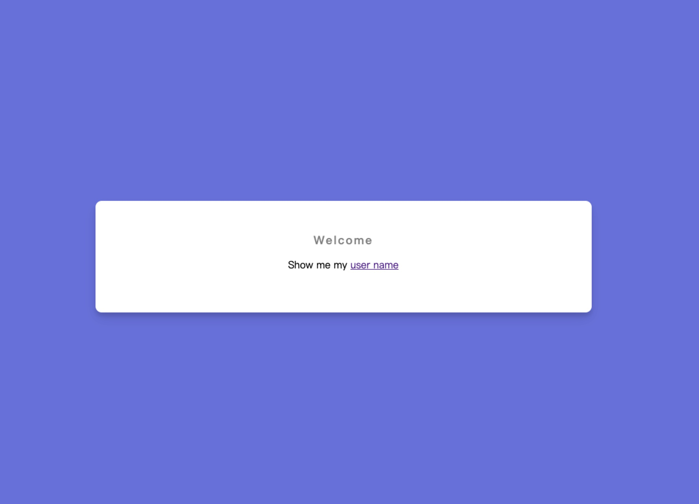
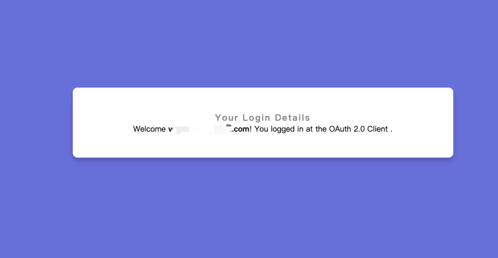
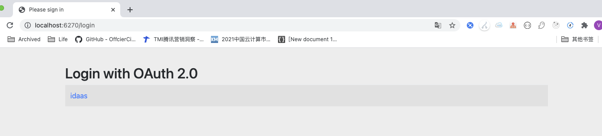

此代码库包含一个示例实现，演示如何使用 Spring Boot 和 Spring Security 通过**不到10行代码**创建 OAuth 2.0 客户端，快速集成IDaaS的OIDC认证协议，能通过 IDaaS 对用户进行身份验证，并获取IDaaS用户详细信息。

## 先决条件

确保在开始之前在 IDaaS 中配置新建OIDC应用，我们假设应用程序将本地部署在redirect uri。我们将获取和配置以下值：

| 参数名称                 | 意义                                                         |
| ------------------------ | ------------------------------------------------------------ |
| Client id                | 客户端唯一标示                                               |
| Client secret            | 安全密钥                                                     |
| Authorization Grant Type | 授权类型, 这里为 authorization_code                          |
| IDaaS Prefix             | 从IDaaS的wellknown中获取，一般格式为 {idaas-domain}/sso/{tn-xxx}/{ai-xxx}/oidc |
| Redirect Uri             | http://localhost:8080/login/oauth2/code/idaas                |


## Configure application.properties

Update the client registration and provider according to above configurations.

```
spring.security.oauth2.client.registration.idaas.clientId={clientId}
spring.security.oauth2.client.registration.idaas.clientSecret={clientSecret}
spring.security.oauth2.client.registration.idaas.authorization-grant-type=authorization_code
spring.security.oauth2.client.registration.idaas.redirect-uri={baseUrl}/login/oauth2/code/{registrationId}
spring.security.oauth2.client.registration.idaas.scope=profile,email
spring.security.oauth2.client.provider.idaas.token-uri={idaas-prefix}/token
spring.security.oauth2.client.provider.idaas.authorization-uri={idaas-prefix}/authorize
spring.security.oauth2.client.provider.idaas.user-info-uri={idaas-prefix}/userinfo
spring.security.oauth2.client.provider.idaas.user-name-attribute=sub
```


## 运行演示应用程序

启动演示应用程序 `mvn spring-boot:run`

导航到`https://localhost:6270`以访问索引站点



访问`https://localhost:6270/user`以触发登录。



您还可以导航到`https://localhost:9443/login`Spring Security 创建的默认登录页面。



## 结语

通过**不到10行代码**, 您可以将 Spring Security 5 与 IDaaS 结合使用，轻松保护您的应用程序。作为开发人员，您只需使用从 IDaaS管理员收到的参数添加客户端注册，并为您的应用程序启用 OAuth2 支持。您可以通过`@AuthenticationPrincipal`和`OidcUser.class`或使用`@RegisteredOAuth2AuthorizedClient`和`OAuth2AuthorizedClient.class`检索客户端获取的访问令牌来访问 ID 令牌中的任何属性。